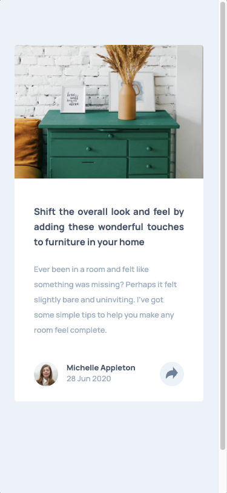
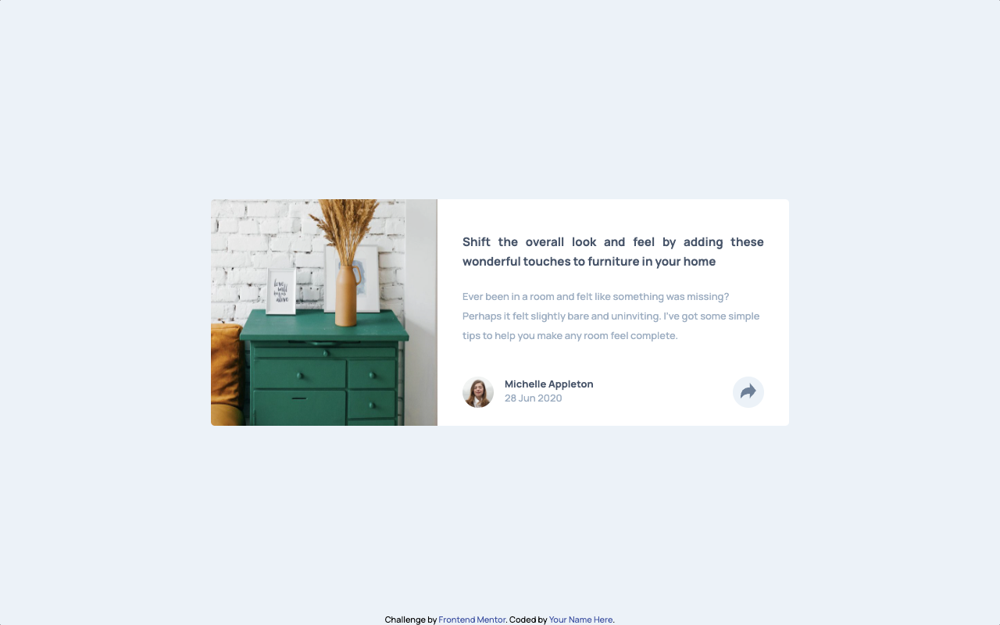

# Frontend Mentor - Article preview component solution

This is a solution to the [Article preview component challenge on Frontend Mentor](https://www.frontendmentor.io/challenges/article-preview-component-dYBN_pYFT). Frontend Mentor challenges help you improve your coding skills by building realistic projects.

## Table of contents

- [Overview](#overview)
  - [The challenge](#the-challenge)
  - [Screenshot](#screenshot)
  - [Links](#links)
- [My process](#my-process)
  - [Built with](#built-with)
  - [What I learned](#what-i-learned)
  - [Continued development](#continued-development)  
- [Author](#author)

**Note: Delete this note and update the table of contents based on what sections you keep.**

## Overview

The challenge of Fronten Mentor consists of making the composition of an article, which at first glance shows that this structure is in two parts; an image and a description.

### The challenge

Users should be able to:

- View the optimal layout for the component depending on their device's screen size
- See the social media share links when they click the share icon

### Screenshot

Alternatively, you can use a tool like [FireShot](https://getfireshot.com/) to take the screenshot. FireShot has a free option, so you don't need to purchase it.

Then crop/optimize/edit your image however you like, add it to your project, and update the file path in the image above.

**Note: Delete this note and the paragraphs above when you add your screenshot. If you prefer not to add a screenshot, feel free to remove this entire section.**

### Links

- Solution URL: [Add solution URL here](https://cyeguez.github.io/Article-preview-Fronted-mentor/)
- Live Site URL: [Add live site URL here](https://github.com/cyeguez/Article-preview-Fronted-mentor)

## My process
I started by placing the semantic tags in the html, trying to give it the best possible shape.

I decided to incorporate SASS into the project to make my work a bit easier, I defined the variables for colors, fonts and general styles, I created a container that would encompass the entire article, basically the container is divided into two sections, the image and text.
I thought that being divided into two parts I could easily change the direction of the article with flex depending on the view of the device.

### Built with

- Semantic HTML5 markup
- CSS custom properties
- Flexbox
- CSS Grid
- SASS
- Mobile-first workflow

**Note: These are just examples. Delete this note and replace the list above with your own choices**

### What I learned

Use this section to recap over some of your major learnings while working through this project. Writing these out and providing code samples of areas you want to highlight is a great way to reinforce your own knowledge.

To see how you can add code snippets, see below:

I learned to be more observant of the details of the composition, to imagine what would be the easiest way to assemble the project, to use figma to measure the size of the elements and thus be able to have an idea of ​​the dimensions and spaces.

If you want more help with writing markdown, we'd recommend checking out [The Markdown Guide](https://www.markdownguide.org/) to learn more.

**Note: Delete this note and the content within this section and replace with your own learnings.**

### Continued development

I would like to focus on honing my skill in Frontend and js development.

## Author
- Name: César Yeguez
- Website - [cyeguez](https://github.com/cyeguez)
- Frontend Mentor - [@cyeguez](https://www.frontendmentor.io/profile/cyeguez)

